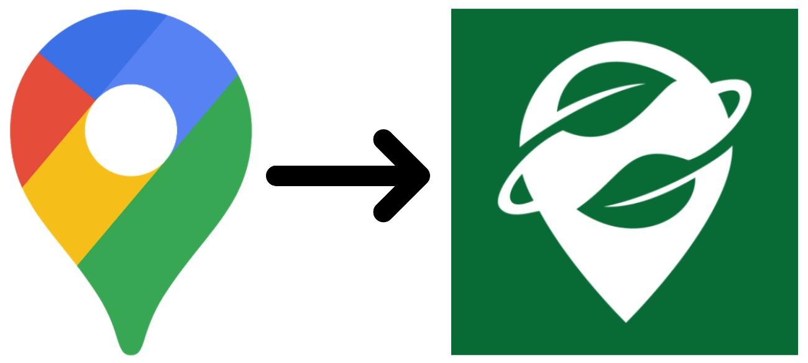

# Convert Google Maps saved places to Organic Maps

This project allows you to convert the `Saved Places.json` file that you get from downloading data from the "Your data in Maps" screen in Google Maps.

## URL

https://rudokemper.github.io/google-maps-places-to-organic-maps/

## Credits

This project uses the `tokml` library from [Mapbox](https://github.com/mapbox/tokml), and the `togpx` library from [tyrasd](https://github.com/tyrasd/togpx).